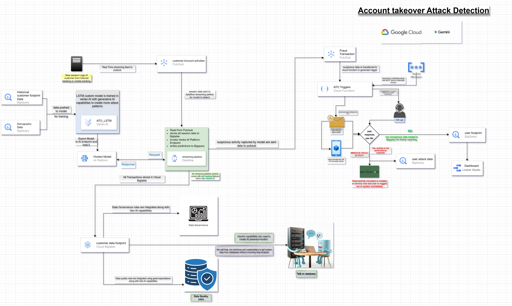

# Account Takeover (ATO) Attack Detection on Google Cloud

## 📌 Overview

### What is Account Takeover (ATO)?

**Account Takeover (ATO)** is a type of fraud where an attacker gains **unauthorized access to a legitimate user account** after successful authentication. This typically happens due to compromised credentials, phishing, malware, SIM swap, or credential stuffing attacks.

In ATO scenarios, **the user has already logged in successfully**, making traditional perimeter or authentication-based security controls insufficient.

---

### Second Line of Defense (2nd LOD) Context

This solution is intentionally designed to operate as a **Second Line of Defense (2nd LOD)**:

* ✅ User login is already successful (1st LOD passed)
* 👀 Continuous monitoring begins **post-login**
* 🧠 Behavioral, session, and transaction patterns are analyzed in real time
* 🚨 Suspicious behavior is detected **during active sessions**

The 2nd LOD sits silently in the background, continuously validating whether the logged-in user is behaving like the genuine account owner.

---

## 📌 Overview

This repository describes an **end-to-end, real-time Account Takeover (ATO) Attack Detection system** built on **Google Cloud Platform (GCP)**. The solution leverages **streaming data pipelines, Vertex AI (LSTM model), BigQuery, Bigtable, Cloud Functions, Pub/Sub, and Gemini (GenAI)** to detect suspicious login and transaction behavior, trigger fraud responses, and continuously improve fraud intelligence.

The architecture is designed for **banking and financial services** use cases where low-latency fraud detection, explainability, scalability, and governance are critical.

---

## 🧠 Key Capabilities

* Real-time user activity ingestion
* Behavioral fraud detection using **LSTM (Long Short-Term Memory)** neural networks
* Session-aware pattern recognition across historical and current activity
* Continuous learning from confirmed fraud and genuine behavior
* Streaming inference with **Vertex AI**
* Automated ATO response workflows (OTP, IVR, account blocking)
* Feedback loop for continuous model improvement
* Built-in **data governance & data quality** controls
* **Gemini-powered GenAI** for pattern discovery and natural language data access

---

## 🧬 What is LSTM and Why It Is Used Here

### What is LSTM?

**LSTM (Long Short-Term Memory)** is a type of **Recurrent Neural Network (RNN)** designed to learn **patterns across sequences of events over time**.

Unlike traditional ML models that look at records independently, LSTM:

* Remembers **long-term and short-term behavior**
* Learns **temporal patterns** (order, frequency, gaps between actions)
* Handles session-based and sequential data effectively

This makes LSTM ideal for **post-login fraud detection**, where *how* a user behaves over time is more important than a single event.

---

### How LSTM Works in This ATO System

In this architecture, the LSTM model acts as the **behavioral brain of the 2nd Line of Defense**.

#### 🔁 Pattern-Based Decision Making

For every **new user event** (login action, transaction, navigation step):

1. The event is **not evaluated in isolation**
2. It is compared against:

   * The user’s **previous session behavior**
   * Historical behavioral patterns stored in BigQuery / Bigtable
   * Learned patterns from known fraud cases
3. The LSTM evaluates:

   * Sequence of actions
   * Speed and timing between actions
   * Device and location continuity
   * Behavioral deviation from normal baseline

The model then produces a **risk score / fraud probability** for that event **in context of past behavior**.

---

### Continuous Learning & Feedback Loop

This system supports **continuous learning**:

* Confirmed fraud cases (user says *NO* or ServiceNow incidents) are stored
* Genuine activity (user says *YES*) is also captured
* These outcomes are fed back into training datasets
* The LSTM model is periodically retrained in **Vertex AI**

This allows the model to:

* Adapt to **new attack patterns**
* Reduce false positives over time
* Learn evolving user behavior

---

### Why This Matters for 2nd Line of Defense

Because attackers may successfully pass login checks:

* Static rules are insufficient
* One-time checks are ineffective

The LSTM ensures that **every new record is evaluated against previous records**, enabling:

* Real-time session risk assessment
* Mid-session fraud interruption
* High-confidence ATO detection

This makes the model a **living, learning control** rather than a static rule engine.

---

* Real-time user activity ingestion
* Behavioral fraud detection using **LSTM models**
* Streaming inference with **Vertex AI**
* Automated ATO response workflows (OTP, IVR, account blocking)
* Feedback loop for continuous model improvement
* Built-in **data governance & data quality** controls
* **Gemini-powered GenAI** for pattern discovery and natural language data access

---

## 🏗️ High-Level Architecture

---

## 🔄 End-to-End Data Flow

### 1️⃣ User Activity Ingestion

* Customer login and transaction events from **Internet Banking / Mobile Banking**
* Events are streamed in **real time to Pub/Sub**

**Component:**

* `Customer Account Activities – Pub/Sub`

---

### 2️⃣ Streaming Fraud Detection Pipeline

* **Dataflow (Streaming)** reads events from Pub/Sub
* Session and behavioral features are enriched
* Data is:

  * Stored in **Cloud Bigtable** (low-latency session storage)
  * Sent to **Vertex AI hosted LSTM model** for inference

**Component:**

* `Dataflow Streaming Pipeline`

---

### 3️⃣ ML Model – ATO LSTM (Vertex AI)

* Custom **LSTM model** trained on:

  * Historical customer footprint data (BigQuery)
  * Demographic data (BigQuery)
* Model is deployed to a **Vertex AI Endpoint**
* Detects:

  * Unusual login behavior
  * Device / location anomalies
  * Session hijacking patterns

**Component:**

* `ATO_LSTM – Vertex AI`

---

### 4️⃣ Suspicious Activity Publishing

* Predictions marked as suspicious are:

  * Written to **BigQuery** for analytics
  * Published to **Fraud Transaction Pub/Sub** for downstream action

---

### 5️⃣ ATO Triggers & Fraud Response

* **Cloud Functions** subscribe to Fraud Pub/Sub
* Secure secrets retrieved from **Secret Manager**
* Automated actions:

  * OTP verification
  * IVR call to customer
  * User confirmation (Yes / No)

**Outcomes:**

* ✅ Non-suspicious → stored for reporting
* ❌ Confirmed fraud → immediate action

---

### 6️⃣ Incident Management & Enforcement

* Confirmed fraud cases:

  * Logged in **ServiceNow**
  * User account blocked immediately
  * Fraud activity stored in BigQuery

**Component:**

* `ServiceNow Integration`

---

### 7️⃣ Analytics & Reporting

* Data stored in BigQuery:

  * User footprint data
  * Attack patterns
  * Fraud confirmation results
* Dashboards built using **Looker Studio**

---

## 🤖 Gemini (GenAI) Integration

Gemini enhances the platform by:

* Discovering **new fraud patterns** automatically
* Assisting in **feature engineering** for model retraining
* Enabling **"Talk to Database"** capabilities:

  * Natural language queries for business & risk teams
  * No SQL expertise required

---

## 🛡️ Data Governance & Quality

### Data Governance

* Integrated governance rules across pipelines
* Ensures compliance with banking regulations

### Data Quality

* Rules enforced using **Great Expectations**
* Schema drift and data anomalies handled proactively

---

## 🧱 Technology Stack

| Layer         | Services           |
| ------------- | ------------------ |
| Ingestion     | Pub/Sub            |
| Streaming     | Dataflow           |
| Storage       | BigQuery, Bigtable |
| ML            | Vertex AI (LSTM)   |
| GenAI         | Gemini             |
| Orchestration | Cloud Functions    |
| Security      | Secret Manager     |
| ITSM          | ServiceNow         |
| Visualization | Looker Studio      |

---

## 🚀 Use Cases

* Account Takeover detection
* Fraudulent login prevention
* Behavioral biometrics
* Risk-based authentication
* Real-time fraud alerting

---

## 📈 Benefits

* Near real-time fraud detection
* Highly scalable & cloud-native
* Explainable ML with feedback loops
* Reduced false positives
* Strong governance & compliance

---

## 📌 Future Enhancements

* Graph-based fraud detection
* Adaptive risk scoring
* Cross-channel fraud correlation
* Multi-region active-active deployment

---

## 📄 License

This project is provided for **reference architecture and educational purposes**.

---

## 🙌 Acknowledgements

Built using **Google Cloud Platform**, **Vertex AI**, and **Gemini Generative AI** to demonstrate next-generation fraud detection systems.
